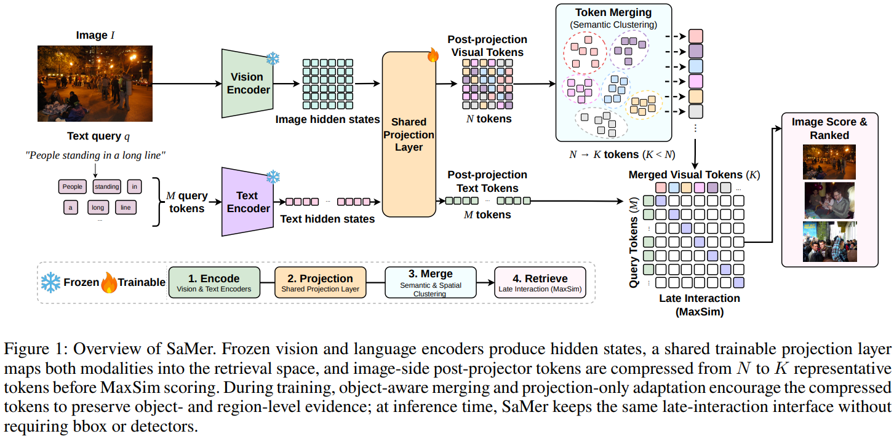

# Do All Visual Tokens Matter Equally? Object-Evidence Preserving Token Merging for Vision-Language Retrieval

<p align="center">
  <a href="https://arxiv.org/abs/2607.04605"><strong>📄Paper</strong></a> ·
  <a href="https://huggingface.co/collections/dmis-lab/samer"><strong>🤗Models</strong></a> ·
  <a href="https://suhyeong10.github.io/samer-project-page/"><strong>🌐Project Page</strong></a>
  
</p>

## Overview



ColPali-style multi-vector retrievers store and score many image-side tokens.
SaMer compresses post-projector visual tokens with an object-aware merge
operator while preserving the original MaxSim retrieval objective.

(1) Feature-Spatial Merging: clusters visual tokens using feature similarity and
spatial proximity.  
(2) Object-Aware Assignment: during training, Flickr30k-Entities boxes provide
instance labels that bias the differentiable merge toward object-consistent
clusters with an additive inconsistency penalty.  
(3) Projection-Only Adaptation: freezes the vision encoder and language
backbone, and trains only the shared projection layer with retrieval loss.

No auxiliary grounding or bbox loss is used. At inference time, SaMer is
bbox-free and applies the same feature-spatial merge before MaxSim scoring. The
default setting uses K=64, cluster iterations=3, spatial weight=0.1, and
assignment temperature=0.07.

## Installation

We recommend Python 3.10 or newer with a CUDA-enabled PyTorch installation.

1. Clone the repository:
   ```bash
   git clone https://github.com/suhyeong10/SaMer.git
   cd SaMer
   ```

2. Install dependencies:
   ```bash
   pip install -r requirements.txt
   ```

Model weights such as `vidore/colpali-v1.3-hf` are loaded from the local
Hugging Face cache or downloaded by Transformers when network access is
available.

## Implementation

### Step 1: Prepare Flickr30k-Entities

Set `DATA_ROOT` to the Flickr30k-Entities directory.

```bash
export DATA_ROOT=/path/to/flickr30k_entities
```

### Step 2: Train SaMer

The default script trains only `embedding_proj_layer`; the backbone remains
frozen.

Single GPU:
```bash
DATA_ROOT=/path/to/flickr30k_entities \
CUDA_VISIBLE_DEVICES=0 \
bash bash/train.sh
```

Multi-GPU without SLURM:
```bash
DATA_ROOT=/path/to/flickr30k_entities \
CUDA_VISIBLE_DEVICES=0,1,2,3 \
NPROC_PER_NODE=4 \
bash bash/train.sh
```

Useful overrides:
```bash
RUN_NAME=samer_k64_colpali \
OUTPUT_DIR=checkpoints/samer_k64_colpali \
TRAIN_BATCH_SIZE=16 \
GRAD_ACCUM_STEPS=4 \
ASSIGNMENT_TEMPERATURE=0.07 \
bash bash/train.sh
```

### Step 3: Build Compressed Retrieval Cache

```bash
DATA_ROOT=/path/to/flickr30k_entities \
ADAPTER_PATH=checkpoints/samer_k64_colpali \
CACHE_DIR=outputs/flickr_samer_k64 \
CUDA_VISIBLE_DEVICES=0 \
bash bash/cache.sh
```

The cache step does not use bbox annotations.

### Step 4: Run Retrieval Inference

```bash
CACHE_DIR=outputs/flickr_samer_k64 \
SPLIT=test \
CUDA_VISIBLE_DEVICES=0 \
bash bash/inference.sh
```

## Evaluation

The included evaluator supports text-to-image retrieval from a saved cache:

```bash
PYTHONPATH=. python scripts/eval.py \
  --cache-dir outputs/flickr_samer_k64 \
  --split test \
  --output-json outputs/flickr_samer_k64/test_metrics.json
```

## Repository Structure

```text
SaMer/
├── assets/                         # Static assets and architecture figures
│   └── architecture.png            # Method overview figure
├── bash/                           # Terminal launch scripts
│   ├── train.sh                    # Projector-only SaMer training
│   ├── cache.sh                    # Compressed retrieval cache builder
│   └── inference.sh                # Retrieval evaluation launcher
├── configs/                        # YAML configuration files
│   └── samer_k64_colpali.yaml      # Default K=64 ColPali SaMer config
├── samer/                          # Core SaMer package
│   ├── cache_io.py                 # Retrieval cache serialization utilities
│   ├── colpali.py                  # ColPali model loading and embedding helpers
│   ├── coords.py                   # Visual token coordinate construction
│   ├── flickr.py                   # Flickr30k-Entities data utilities
│   ├── losses.py                   # Retrieval-only training loss
│   ├── merging.py                  # SaMer feature-spatial object-aware merging
│   ├── metrics.py                  # Retrieval metrics
│   ├── scoring.py                  # MaxSim scoring utilities
│   ├── train_data.py               # Training dataset and collator
│   └── training.py                 # Projector-only training wrapper
├── scripts/                        # Python entrypoints
│   ├── train.py                    # Training entrypoint
│   ├── cache.py                    # Cache construction entrypoint
│   └── eval.py                     # Retrieval evaluation entrypoint
├── .gitignore
├── requirements.txt                # Python dependencies
└── README.md                       # Project documentation
```

## Citation
```bib
@misc{park2026visualtokensmatterequally,
      title={Do All Visual Tokens Matter Equally? Object-Evidence Preserving Token Merging for Vision-Language Retrieval},
      author={Suhyeong Park and Junha Jung and Jungwoo Park and Jaewoo Kang},
      year={2026},
      eprint={2607.04605},
      archivePrefix={arXiv},
      primaryClass={cs.IR},
      url={https://arxiv.org/abs/2607.04605},
}
```
